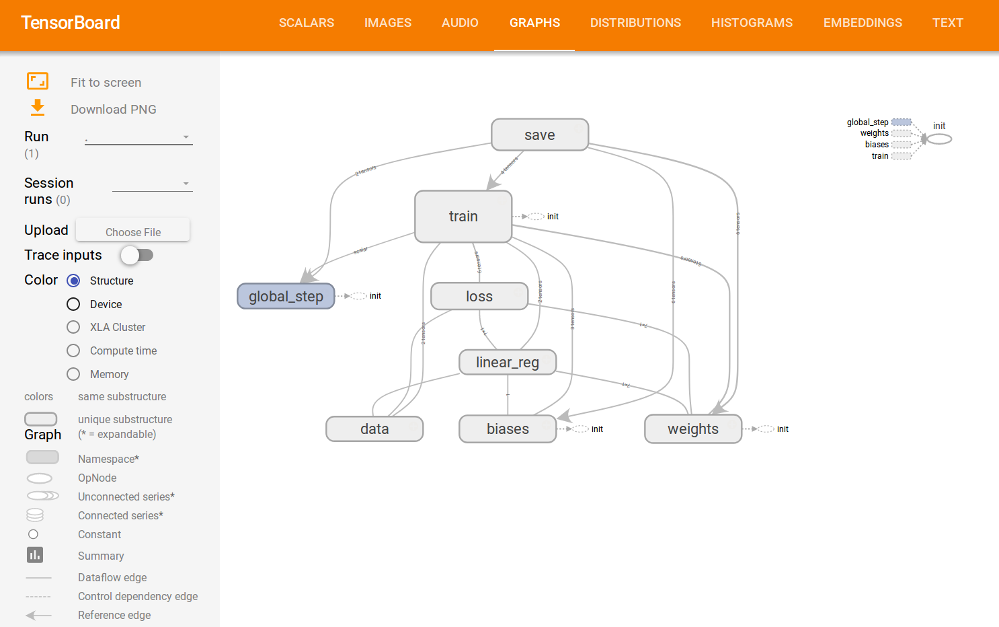

<center>
<p>
  <b style="font-size: 1.5em">Presentation of Tensorflow</b>
</p>
  </br>
  <div style="font-size: 0.9em">Oslandia WTF #10</div>
  </br>
  <em style="font-size: 0.7em">Raphaël Delhome</em>
  </div>
</center>

<!-- .slide: data-background="oslbackground.png" data-background-size="650px" -->
<!-- -->

---

## Introduction to Tensorflow
<!-- .slide: data-background="oslbackground.png" data-background-size="650px" -->
<!-- -->

---

### What's Tensorflow?

A powerful open source Python library "for numerical computation using data flow graphs <a href="https://www.tensorflow.org/">(see Tensorflow website)</a>

+ Designed for machine learning and neural network research...
+ ... but generic: may be used for other purposes
+ flexibility (computation on CPUs and/or GPUs)
+ readibility (tensor visualization on a server)

---

### How to begin

Import Tensorflow within Python:

```python
import tensorflow as tf
```

---

### Tensors

Constant tensors:

```python
s = tf.constant(2, name="scalar")
v = tf.constant([0,1,2], name="vector")
m = tf.constant([[0,1],[2,3]], name="matrix")
```

---

### Tensors

Variable and placeholder tensors:

```python
v1 = tf.Variable(2.0, name="variable_1") # or 'tf.get_variable'
p1 = tf.placeholder(tf.float32, shape=[1,2], name="placeholder_1")
```

---

### Tensors

Operations between tensors:

```python
add = tf.add(a, v, name="simple_addition")
mult = tf.multiply(v, v1, name="simple_multiplication")
matmul = tf.matmul(p1, m, name="matrix_multiplication")
```

---

### Tensor value computation

Need for opening a session:

```python
session = tf.Session()
# <Some tensorflow stuff>
session.close() # Do not forget to close the session!
```
Or, alternatively:
```python
with tf.Session() as session:
    # <Some tensorflow stuff>
```

---

### Tensor value computation

Run the tensors to extract their value:
```python
with tf.Session() as session:
    s_, v_, m_ = session.run([s, v, m])
	print(s_, v_, m_)
```

---

### Tensor value computation

Be careful to the variable initialization!
```python
init_1 = v1.initializer()
init_2 = tf.variables_initializer(v1, name="initializer_2")
init_3 = tf.global_variable_initializer()
with tf.Session() as session:
    sess.run(init_1)
	sess.run(init_2)
	sess.run(init_3)
```

---

### Tensor value computation

Print the variable value with the *eval()* function
```python
with tf.Session() as session:
    print(v1) # Print the variable
	print(v1.eval()) # Print the variable value
```

---

### Tensor value computation

The placeholders are fed during the session while running:
```python
with tf.Session() as session:
    the_placeholder = sess.run(p1, feed_dict={[10,20]})
	print(the_placeholder)
```

---

## Linear regression with Tensorflow
<!-- .slide: data-background="oslbackground.png" data-background-size="650px" -->
<!-- -->

---

### Model construction

By assuming we have the following structures:

+ `x`: an 2d-array containing `n` individuals characterized by `k` features (input)
+ `y`: a vector of `n` observations (output)

**Goal:** Predicting the value of `y` starting from `x` and a linear model `y_ = w * x + b` such that

+ `y_` is a vector of `n` observations (predictions)
+ `w` is a vector of `k` values (weights)
+ `b` is a scalar (bias)

---

### Input layer

`x` and `y` will be stored into following placeholders:
```python
with tf.name_scope("data"):
    X = tf.placeholder(tf.float32, name="x")
	Y = tf.placeholder(tf.float32, name="y")
```

As a remark, the Tensorflow name scopes may be used to improve model readibility

---

### Output layer

No need of hidden layer here! Everything is managed in the output layer:
```python
with tf.name_scope("linear_reg"):
    # weights will be initialized as random values
    w = tf.get_variable('weights', [x.shape[1], 1], initializer=tf.truncated_normal_initializer())
	# bias will be initialized at 0.0
    b = tf.get_variable('biases', [1], initializer=tf.constant_initializer(0.0))
	# linear model formula, in tensorflow
    y_ = tf.add(tf.matmul(X, w), b)
```

---

### Optimization

The goal is to minimize the sum of squared differences between predictions and true values of `y`:
```python
with tf.name_scope('loss'):
    loss = tf.reduce_sum(tf.square(y_ - Y)) # Plus an optional regularization term
    optimizer = tf.train.AdamOptimizer(0.01).minimize(loss)
```

---

### Model running

After building the model graph, the model itself can be run. We can imagine that 10000 iterations are done, and that the model state (loss) is printed each 100 steps:
```python
init = tf.global_variables_initializer()
with tf.Session() as session:
    session.run(init)
	for epoch in range(10000):
        session.run(optimizer, feed_dict={X: x, Y: y_})
        if epoch % 100 == 0:
            loss = session.run(loss, feed_dict={X: x, Y: y_})
			print("epoch {0}: loss = {1}".format(epoch, loss))
```

---

## Convolutional neural network with Tensorflow
<!-- .slide: data-background="oslbackground.png" data-background-size="650px" -->
<!-- -->

---

### Prerequisite

*Goal: automatic digit recognition*

We admit the existence of following structures:

+ `x` a set of pictures of shape `[n,n]`
+ `y` a one-hot array of ten values ('1' for the true digit, '0' for the others)

---

### Input layer

As for linear model, `x` and `y` will be stored in dedicated placeholders:
```python
with tf.name_scope("data"):
    X = tf.placeholder(tf.float32, [None, n, n, 1], name='X')
    Y = tf.placeholder(tf.float32, [None, 10], name='Y')
```

---

### Convolutional layer

A convolution consists in turning the image into alternative ones thanks to a convolution filter. 
```python
with tf.variable_scope('conv1') as scope:
    # Convolution filter of size 5*5 (generates 32 new images)
    kernel = tf.get_variable('kernel',
                             [5, 5, 1, 32],
                             initializer=tf.truncated_normal_initializer())
    # Biases of the convolution
    biases = tf.get_variable('biases',
                             [32],
                             initializer=tf.constant_initializer(0.0))
	# Convolution operation
    conv = tf.nn.conv2d(X, kernel, strides=[1, 1, 1, 1], padding='SAME')
	conv_with_bias = tf.add(conv, biases)
	# Activation function
    act_conv = tf.nn.relu(conv_with_bias, name=scope.name)
```

---

### Max pooling layer

A pooling layer permits to reduce the dimensionality of the images. Here we consider the maximum value within a subregion of 2*2 pixels:
```python
with tf.variable_scope('pool1') as scope:
    pool = tf.nn.max_pool(act_conv,
                           ksize=[1, 2, 2, 1],
                           strides=[1, 2, 2, 1],
                           padding='SAME')
```

---

### Fully-connected layer

A fully-connected layer is such that each downstream neuron is connected to each upstream neuron. It permits to modify the number of channel in the downstream layer.
```python
with tf.variable_scope('fc') as scope:
    # create weights and biases (dimension n/2 because of the max pooling operation)
    w = tf.get_variable('weights', [n/2*n/2*32, 1024], initializer=tf.truncated_normal_initializer())
    b = tf.get_variable('biases', [1024], initializer=tf.constant_initializer(0.0))
    # reshape pool to 2 dimensions to apply matrix operations
    pool = tf.reshape(pool, [-1, n/2*n/2*32])
    # apply relu on the resulting layer
    fc = tf.nn.relu(tf.add(tf.matmul(pool, w), b), name='relu')
```

---

### Output layer

In the output layer, the logits (scores) for each output class are computed, as well as the associated predictions through the `softmax` activation function:
```python
with tf.variable_scope('softmax_linear') as scope:
    w = tf.get_variable('weights', [1024, 10], initializer=tf.truncated_normal_initializer())
    b = tf.get_variable('biases', [10], initializer=tf.random_normal_initializer())
    logits = tf.add(tf.matmul(fc, w), b)
    Ypredict = tf.nn.softmax(logits)
```

---

### Loss function design

To evaluate the model run, cross-entropy over each individuals is computed; knowing that the mean cross-entropy must be minimized. The model accuracy comes with the comparison between observed and predicted `y` values:
```python
with tf.name_scope('loss'):
    # cross-entropy between predicted and real values
    entropy = tf.nn.softmax_cross_entropy_with_logits(labels=Y, logits=logits)
    loss = tf.reduce_mean(entropy, name="loss")
	optimizer = tf.train.AdamOptimizer(0.01).minimize(loss)

with tf.name_scope('accuracy'):
    # accuracy of the trained model, between 0 (worst) and 1 (best)
    correct_prediction = tf.equal(tf.argmax(Y, 1), tf.argmax(Ypredict, 1))
    accuracy = tf.reduce_mean(tf.cast(correct_prediction, tf.float32))
```

---

### Model running

As previously, we train the model for (let's say) 10000 iterations, and print the training state each 100 iterations:
```python
with tf.Session() as sess:
    sess.run(tf.global_variables_initializer())

    for index in range(10000):
        sess.run(optimizer, feed_dict={X: x, Y: y_})
        if index % 100 == 0:
            loss_batch, accuracy_batch = sess.run([loss, accuracy], feed_dict={X: x, Y: y_}) 
            print('Step {}: loss = {:5.1f}, accuracy = {:1.3f}'
			      .format(index, loss_batch, accuracy_batch))
```

---

### To go further

Of course this model may be improved in several ways:

+ Add convolutional, pooling and/or fully-connected layers
+ Tune the parameters (*e.g.* number of layer channels, or the learning rate)
+ Add dropout operations to avoid overfitting
+ ...

---

## Other Tensorflow functionalities
<!-- .slide: data-background="oslbackground.png" data-background-size="650px" -->
<!-- -->

---

### Graph summary

Tensorflow allows to visualize the objets contained into the workspace.

A writer should be declared during the session:
```python
with tf.Session() as sess:
    writer = tf.summary.FileWriter('./graphs/path_to_graph', sess.graph)
	# <Some tensorflow stuff>
```

The local server is started on a specific port, it is accessible through your favorite web browser:
```bash
tensorboard --logdir ./graphs/path_to_graph --port 6006
```

---

### Graph summary

Example:



---

### Training backups

**Principle**

Store the current state of a model training, that can be interrupted (it may be long); train a model again and again without resetting the process at each time

*First step:* Prepare the checkpoint creation

```python
import os
os.mkdir("checkpoints")
os.mkdir("checkpoints/the_model")
```

---

### Training backups

*Second step:* create a variable to store the training step and use it during the minimization effort

```python
with tf.name_scope('train'):
    global_step = tf.Variable(0, dtype=tf.int32, trainable=False, name="training_step")
    optimizer = (tf.train.AdamOptimizer(learning_rate)
	             .minimize(loss, global_step=global_step))
```

---

### Training backups

*Third step:* declare a saver object, and manage the checkpoints

```python
with tf.Session() as session:
	saver = tf.train.Saver()
	ckpt = tf.train.get_checkpoint_state(
	       os.path.dirname('checkpoints/my_model/checkpoint'))
	# if that checkpoint exists, restore from checkpoint
	if ckpt and ckpt.model_checkpoint_path:
		saver.restore(session, ckpt.model_checkpoint_path)
	# <Some tensorflow stuff>
```

---

### Training backups

*Fourth step:* recover the training current state, and do the next training steps, by saving some new backups
```python
with tf.Session() as session:
    # <Some checkpoint management operations>
    initial_step = global_step.eval(session=session)
	for step in range(initial_step, total_nb_epoch):
	    # <Some tensorflow stuff>
		if step % saving_step == 0:
		    saver.save(session,
			           "checkpoints/the_model/step",
					   global_step=step
```

---

## References and documentation

<!-- .slide: data-background="oslbackground.png" data-background-size="650px" -->
<!-- -->

---

### References

+ <p style="font-size: 80%;"><a href="https://www.tensorflow.org/">Tensorflow website</a></p>
+ <p style="font-size: 80%;">Tensorflow Stanford course (Chip Huyen)</p>
<ul style="padding-left:20px">
    <li style="font-size: 60%;"><a href="http://web.stanford.edu/class/cs20si/syllabus.html">Course outline</a></li>
    <li style="font-size: 60%;"><a href="https://github.com/chiphuyen/stanford-tensorflow-tutorials/tree/master/examples">Code on Github</a></li>
</ul>
+ <p style="font-size: 80%;">An example of linear regression (Florian Courtial)</p>
<ul style="padding-left:20px">
    <li style="font-size: 60%;"><a href="https://matrices.io/deep-neural-network-from-scratch/">Blog</a></li>
    <li style="font-size: 60%;"><a href="https://github.com/theflofly/dnn_from_scratch_py">Code on Github</a></li>
</ul>
+ <p style="font-size: 80%;">Convolutional Neural Network (Martin Görner)</p>
<ul style="padding-left:20px">
    <li style="font-size: 60%;"><a href="https://codelabs.developers.google.com/codelabs/cloud-tensorflow-mnist/">Tutorial</a></li>
    <li style="font-size: 60%;"><a href="https://github.com/martin-gorner/tensorflow-mnist-tutorial">Code on Github</a></li>
    <li style="font-size: 60%;"><a href="http://yann.lecun.com/exdb/mnist/">MNIST database</a></li>
</ul>
+ <p style="font-size: 80%;">Tensorflow usecase examples (Aymeric Damien)</p>
<ul style="padding-left:20px">
    <li style="font-size: 60%;"><a href="https://github.com/aymericdamien/TensorFlow-Examples">Code on Github</a></li>
</ul>
